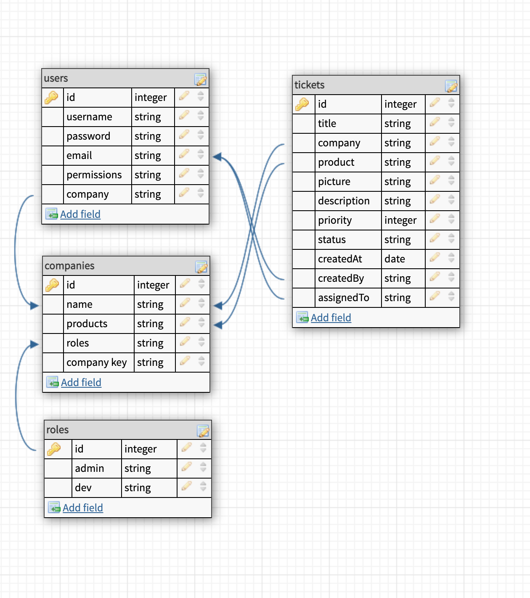
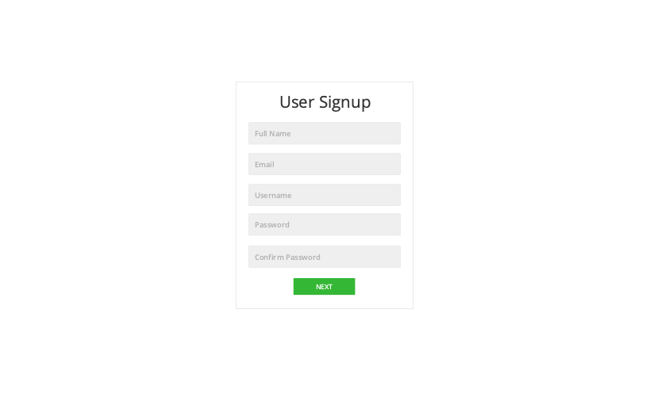
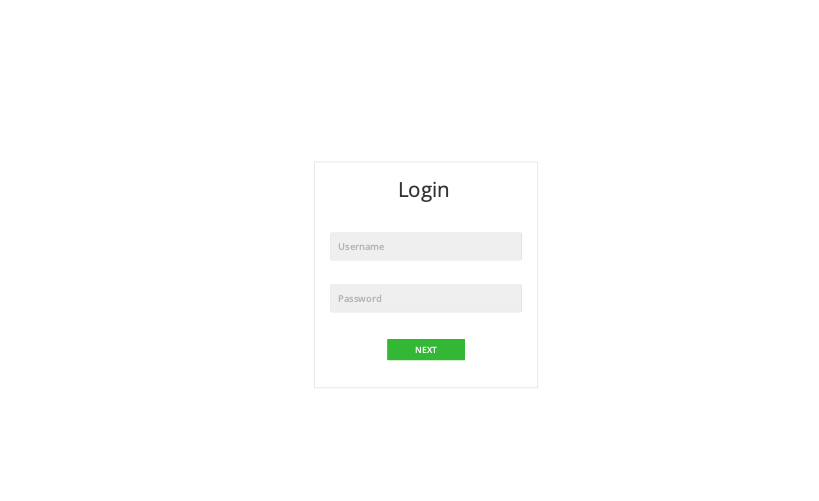
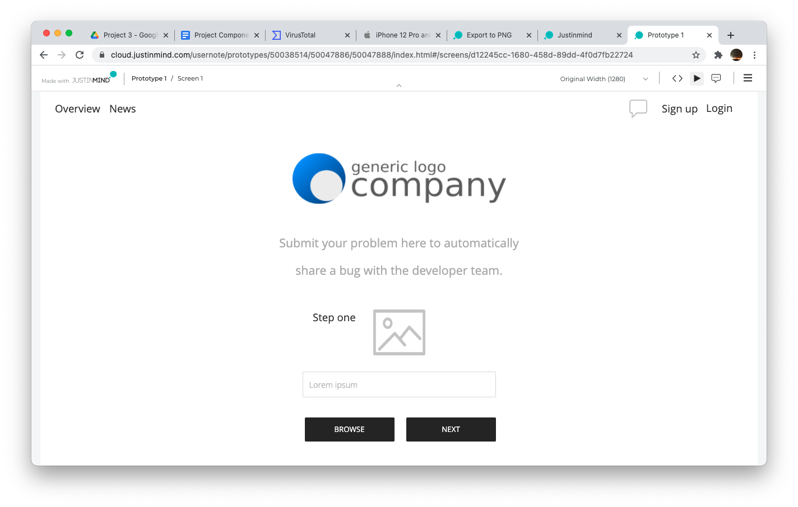
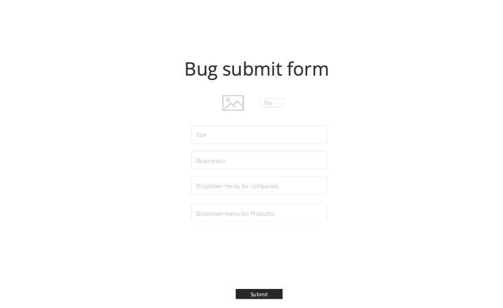
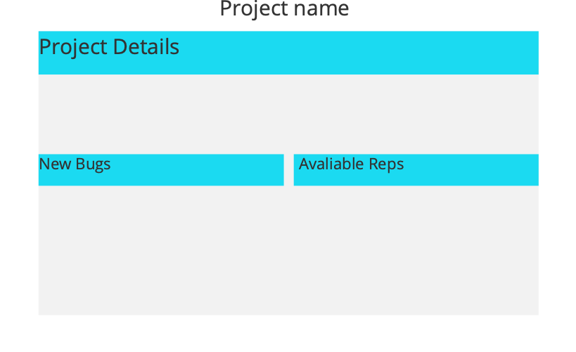
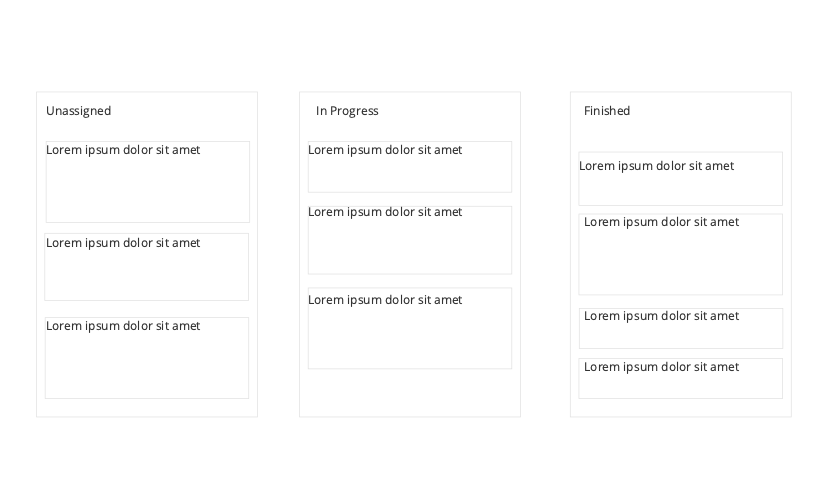

# PDR (Pest Damage Report)

A bug tracking program that keeps up with bugs on your website! Users can submit bugs, chat directly with representatives, and comment on bugs they have submitted. if the user has an account they can keep up with all the bugs they have submitted and get updates on said bugs. Admins of the website can see all bugs submitted, comment on bugs, delete comments, and assign bugs to developers to fix.

## Live [Site](https://pestdamagereport.herokuapp.com/)

## Backend [Repo](https://github.com/sschneeberg/pdr-backend)

## User Stories

As a `customer` i want to submit bug reports to the companies whose product that I use, comment on bugs i have submitted, chat directly with representitives and if logged in get feeback on my bugs. I want to be able to see the tickets I have submitted, their current status, and any related comments.

As a `software company` I want to sign up developers under my company name to manage and address customer submitted bug reports. I want to have admin users who can manage ticket assignment and support accounts (like Devs and Support) who will address bugs, interact with the customers and close out tickets.

## Features

### Submit a bug

Users can submit a bug on the homepage of the site with the following feilds: title, description, company, product, image.

### Admin Account

When logged into an admin account, the admin can see all bugs submitted to their company, comment on bugs, delete comments, set the severity of the bug, assign bugs to developers, and chat directly with customers.

### Developer Account

When logged into a developer account, the developer can see all bugs assigned to them, set the status of the bug assiged to them by dragging and dropping the bug into the corresponding column, comment on bugs, and chat directly with customers.

### User Account

When logged into a user account, the user can see and comment on all bugs they have submitted and chat directly with representives.

## Installation

### Frontend Setup

1. Fork and Clone this directory (And the [backend directory](https://github.com/sschneeberg/pdr-backend)) to your local machine
2. Run `npm install` to download dependencies
3. Set up your .env file with `REACT_APP_SERVER_URL=http://localhost:8000`

### Backend Setup

1. Follow steps on Mongo Atlas to connect databse with repository
2. paste link given to you inside of the repository

### Final steps

1. Run `npm start` on both repositories
2. Go to `http://localhost:3000` to see the website

## Dependencies

-   API Requests: axios
-   Database: MongoDB
-   Messaging: socket.io-client
-   Dragging & Dropping: react-beautiful-dnd
-   Authentication and Protection: jwt-decode, dotenv
-   Styling: react-Bootstrap
-   React Functionality: react, react-dom, react-form-input-validation, react-router-dom, react-scripts

## Model

## Wireframes

## Styling

`IMAGES OF FINISHED SITE`

## Stretch goals

We hope to continue working on this again in a few weeks. Here are the things we would like to include:

-   Live video chat options between customer and support
-   Embeddable bug submit for companies to include in their sites
-   Google OAuth interation
-   Search tickets feature in Admin Dashboard
-   Removing older, completed tickets from Company dashboards (but not from the database)
-   Code refactoring for efficiency
-   And Some small tweaks like adding more products after a company signs up, switching instead of adding developers as assigned to tickets, including a count of how many tickets a developer has to effectively delegate

## From React: Available Scripts

In the project directory, you can run:

### `npm start`

Runs the app in the development mode.\
Open [http://localhost:3000](http://localhost:3000) to view it in the browser.

The page will reload if you make edits.\
You will also see any lint errors in the console.

### `npm test`

Launches the test runner in the interactive watch mode.\
See the section about [running tests](https://facebook.github.io/create-react-app/docs/running-tests) for more information.

### `npm run build`

Builds the app for production to the `build` folder.\
It correctly bundles React in production mode and optimizes the build for the best performance.

The build is minified and the filenames include the hashes.\
Your app is ready to be deployed!

See the section about [deployment](https://facebook.github.io/create-react-app/docs/deployment) for more information.

### `npm run eject`

**Note: this is a one-way operation. Once you `eject`, you can’t go back!**

If you aren’t satisfied with the build tool and configuration choices, you can `eject` at any time. This command will remove the single build dependency from your project.

Instead, it will copy all the configuration files and the transitive dependencies (webpack, Babel, ESLint, etc) right into your project so you have full control over them. All of the commands except `eject` will still work, but they will point to the copied scripts so you can tweak them. At this point you’re on your own.

You don’t have to ever use `eject`. The curated feature set is suitable for small and middle deployments, and you shouldn’t feel obligated to use this feature. However we understand that this tool wouldn’t be useful if you couldn’t customize it when you are ready for it.
